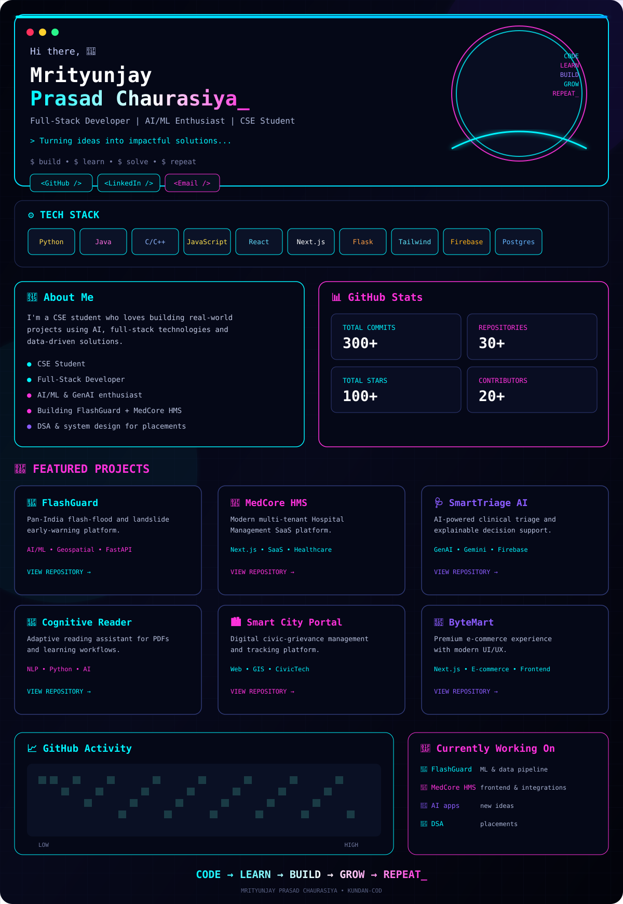

<!--
  The dashboard above is intentionally a complete cyber/neon profile composition,
  rather than a photo frame or a normal white README with a banner on top.
  All project links inside the SVG are clickable.
-->

<b>⌘ Accessible / text version</b>

### Mrityunjay Prasad Chaurasiya_

**Full-Stack Developer · AI/ML Enthusiast · CSE Student**

> Turning ideas into impactful solutions.

- 🌊 [FlashGuard](https://github.com/Kundan-cod/FlashGuard-Pan-India-Early-Warning-Platform) — Pan-India flash-flood and landslide early-warning platform
- 🏥 [MedCore HMS](https://github.com/Kundan-cod/MedCore-HMS) — Multi-tenant hospital-management SaaS
- 🩺 [SmartTriage AI](https://github.com/Kundan-cod/SmartTriageAI) — AI-powered clinical triage
- 📖 [Cognitive Reader](https://github.com/Kundan-cod/Cognitive-Reader) — Adaptive reading assistant
- 🏙️ [Smart City Portal](https://github.com/Kundan-cod/smart_public_complaint_system) — Civic grievance platform
- 🛒 [ByteMart](https://github.com/Kundan-cod/ByteMart-Premium-E-Commerce-Platform) — Modern e-commerce platform

**Tech:** Python · Java · C/C++ · JavaScript · React · Next.js · Flask · Tailwind · Firebase · PostgreSQL · Git · Docker

**Currently working on:** FlashGuard ML/data pipeline · MedCore HMS frontend/integrations · AI applications · DSA/system design

**Links:** [GitHub](https://github.com/Kundan-cod) · [LinkedIn](https://www.linkedin.com/in/mrityunjay-chaurasiya-488669319) · [Email](mailto:kundanchaurasiya839@gmail.com)

