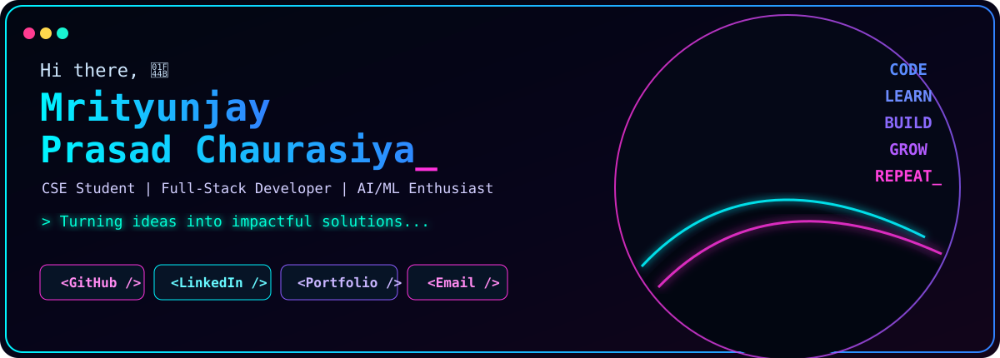

 

<table width="100%">
<tr>
<td align="center" colspan="5">

### ⚙️ Tech Stack

</td>
</tr>
</table>

<table width="100%">
<tr>
<td width="50%" valign="top">

## 🔵 About Me

I'm a **CSE student** who loves building real-world projects using AI, full-stack technologies and data-driven solutions.

- 🎓 CSE Student
- 💻 Full-Stack Developer
- 🤖 AI/ML & GenAI enthusiast
- 🌊 Building **FlashGuard**
- 🏥 Building **MedCore HMS**
- 🧩 Strengthening DSA & system design
- 🚀 Always exploring new technologies

</td>
<td width="50%" valign="top">

## 📊 GitHub Stats

 

</td>
</tr>
</table>

## 🚀 Featured Projects

<table width="100%">
<tr>
<td width="33%" valign="top">

### 🌊 FlashGuard

**Pan-India flash-flood and landslide early-warning platform.**

`AI/ML` `Geospatial` `FastAPI`

</td>
<td width="33%" valign="top">

### 🏥 MedCore HMS

**Modern multi-tenant Hospital Management SaaS platform.**

`Next.js` `SaaS` `Healthcare`

</td>
<td width="33%" valign="top">

### 📖 Cognitive Reader

**Adaptive reading assistant for PDFs and learning workflows.**

`NLP` `Python` `AI`

</td>
</tr>
</table>

<table width="100%">
<tr>
<td width="33%" valign="top">

### 🩺 SmartTriage AI

AI-powered clinical triage and explainable decision support.

`GenAI` `Gemini` `Firebase`

<a href="https://github.com/Kundan-cod/SmartTriageAI">**View Repository →**</a>

</td>
<td width="33%" valign="top">

### 🏙️ Smart City Portal

Digital civic-grievance management and tracking platform.

`Web` `GIS` `CivicTech`

<a href="https://github.com/Kundan-cod/smart_public_complaint_system">**View Repository →**</a>

</td>
<td width="33%" valign="top">

### 🛒 ByteMart

Premium e-commerce experience with modern UI/UX.

`Next.js` `E-commerce` `Frontend`

<a href="https://github.com/Kundan-cod/ByteMart-Premium-E-Commerce-Platform">**View Repository →**</a>

</td>
</tr>
</table>

## 📈 GitHub Activity

 

<table width="100%">
<tr>
<td width="55%" valign="top">

## 🧠 Featured Work

- 🌊 **FlashGuard** — Geospatial / AI-ML
- 🏥 **MedCore HMS** — Next.js / SaaS
- 🩺 **SmartTriage AI** — GenAI / Healthcare
- 📖 **Cognitive Reader** — NLP / Python

</td>
<td width="45%" valign="top">

## 🎯 Currently Working On

- 🌊 FlashGuard — ML & data pipeline
- 🏥 MedCore HMS — frontend & integrations
- 🤖 AI-powered applications — new ideas
- 🧩 DSA & System Design — placements

</td>
</tr>
</table>

### `CODE` → `LEARN` → `BUILD` → `GROW` → `REPEAT_`

> **Good software is built by curiosity, consistency and care.**

